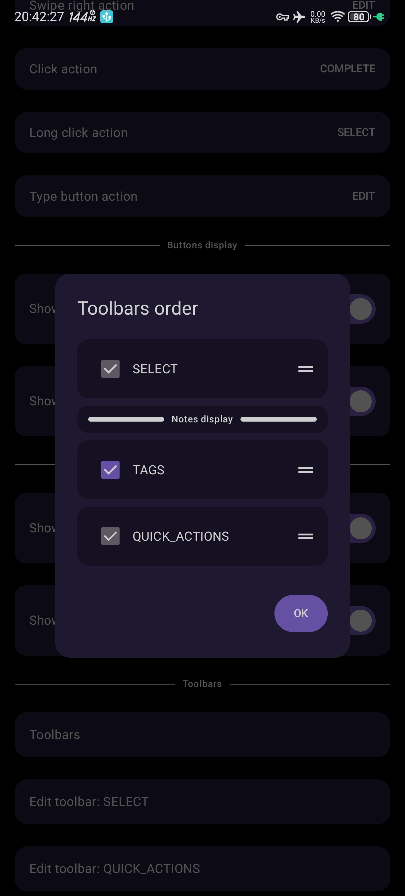
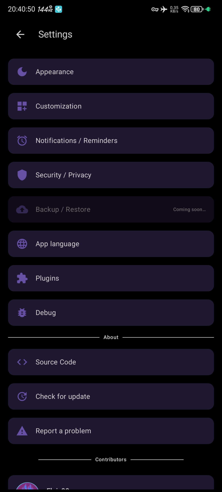
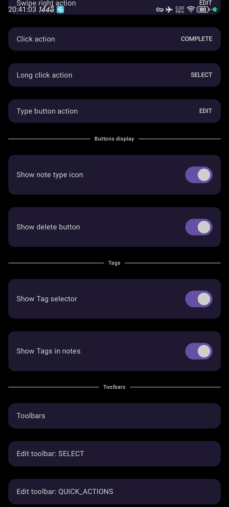
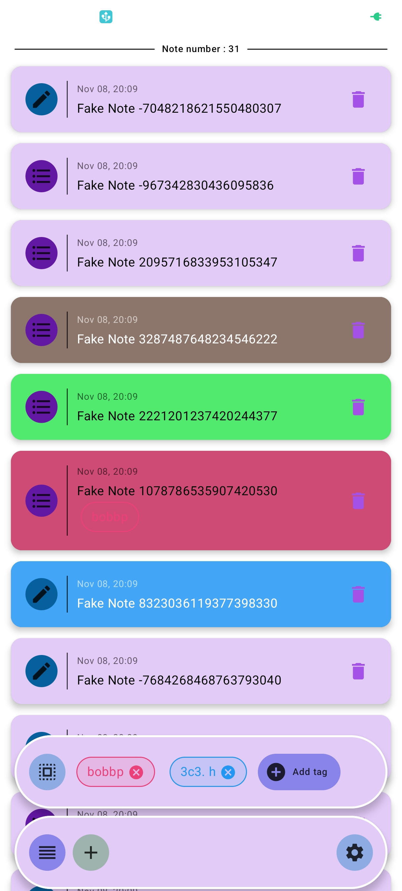
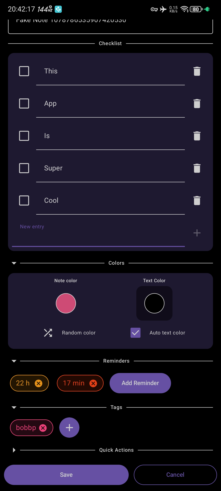
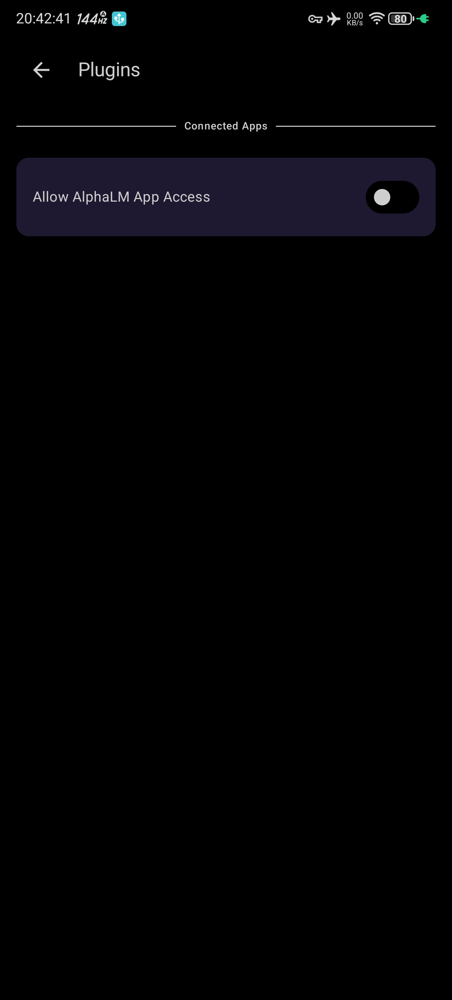
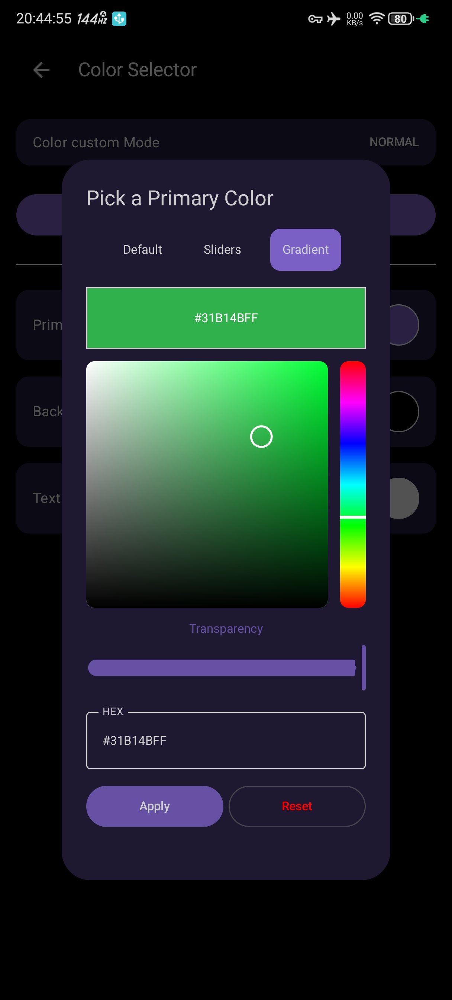
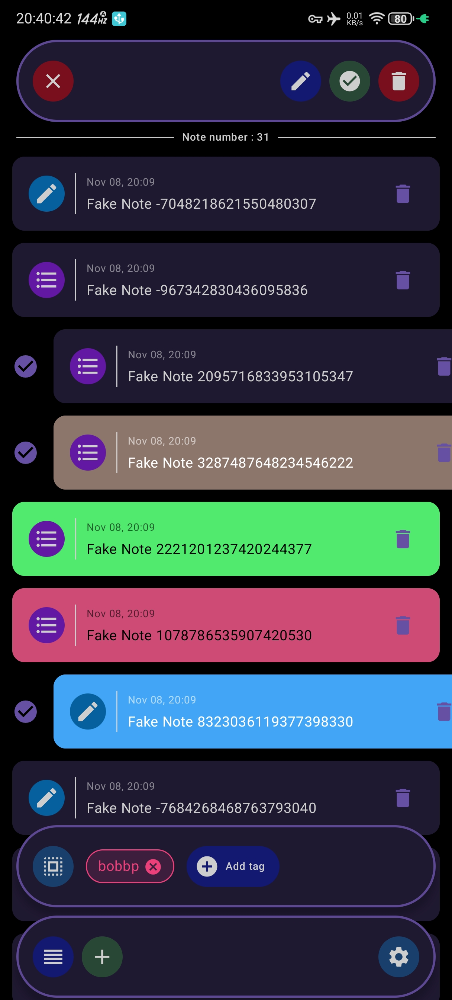

# 📝 Notes — `Abndroid` Notes App

Modern, privacy-focused Android note-taking app built with **Jetpack Compose** and **Material 3**.  

---

## ✨ Features

- 🗒️ **Rich note-taking**
- 🎨 **Fully customizable UI**
- 🔔 **Reminders**
- 🔐 **Security (Biometrics and/or PIN)**
- 💾 **Fully offline (cannot connect to internet)**

---

## 🚀 Roadmap

* [x] Enable default light/dark or more custom or all colors
* [x] Add preset colors in color pickers
* [ ] Note attachments (images, audio)
* [ ] Notes reordering
* [ ] Notes resizable
* [x] Custom Notes colors
* [x] Search & tags
* [ ] Encrypted Notes database
* [ ] Backup encryption
* [x] Translations
* [ ] Add due date
* [ ] Show how many days / hours / min left
* [ ] Show note detail
---

## 🤝 Contributing

Pull requests are **welcome**!

Steps:

1. Fork the repository
2. Create a new branch
3. Commit and push your changes
4. Open a PR 🚀

---

## 🧾 License

```
MIT License © 2025
```

Feel free to use, modify, and distribute this project with attribution.

---

### 📸 Screenshots 


| Settings                                              | Toolbars editor                                                    | Settings main                                                  | Dark theme                                               | Settings customisation                                                           | Light theme                                                | Notes editor                                                 | Alpha llm integration                                                          | Color selector                                                   | Notes screen                                                 | Toolbars items editor                                                          |
|-------------------------------------------------------|--------------------------------------------------------------------|----------------------------------------------------------------|----------------------------------------------------------|----------------------------------------------------------------------------------|------------------------------------------------------------|--------------------------------------------------------------|--------------------------------------------------------------------------------|------------------------------------------------------------------|--------------------------------------------------------------|--------------------------------------------------------------------------------|
|  |  |  |  |  |  |  |  |  |  |  |