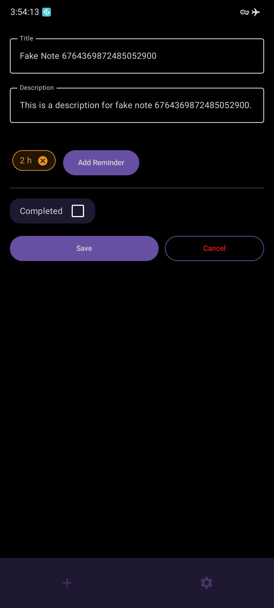
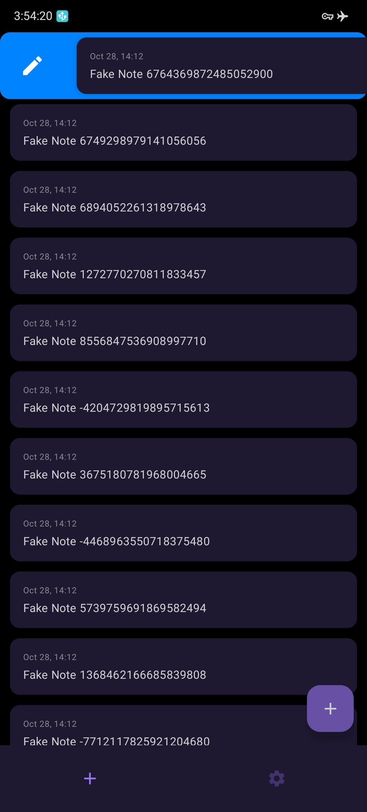
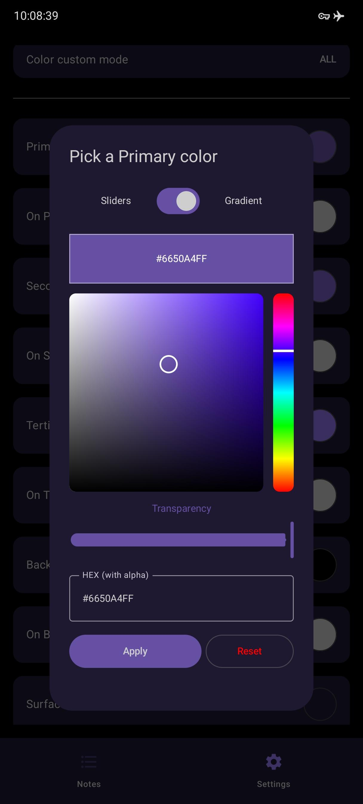
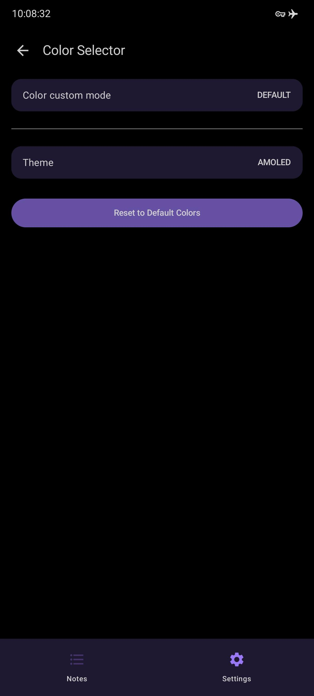

# 📝 Notes — Android Notes App

**Notes** is a modern, privacy-focused Android note-taking app built with **Jetpack Compose** and **Material 3**.  

---

## ✨ Features

- 🗒️ **Rich note-taking**
- 🎨 **Beautiful customizable UI**
- 🔔 **Reminders**
- 🔐 **Security (Biometrics and/or PIN)**
- ☁️ **Backup & restore**
- 💾 **Fully offline (cannot connect to internet)**

---

## 🚀 Roadmap

* [ ] Enable default light/dark or more custom or all colors
* [ ] Note attachments (images, audio)
* [ ] Notes reordering
* [ ] Notes resizable
* [ ] Custom Notes colors
* [ ] Search & tags
* [ ] Encrypted Notes database
* [ ] Backup encryption
* [ ] Translations
* [ ] Show how many days / hours / min left
---

## 🤝 Contributing

Pull requests are welcome!

Steps:

1. Fork the repository
2. Create a new branch
3. Commit and push your changes
4. Open a PR 🚀

---

## 🧾 License

```
MIT License © 2025
```

Feel free to use, modify, and distribute this project with attribution.

---

### 📸 Screenshots 


| Editor                                               | Note List                                            | Color Picker                                          | Settings                                           | Selector                                                |
|------------------------------------------------------|------------------------------------------------------|-------------------------------------------------------|----------------------------------------------------|---------------------------------------------------------|
|  |  |  |  |  |
